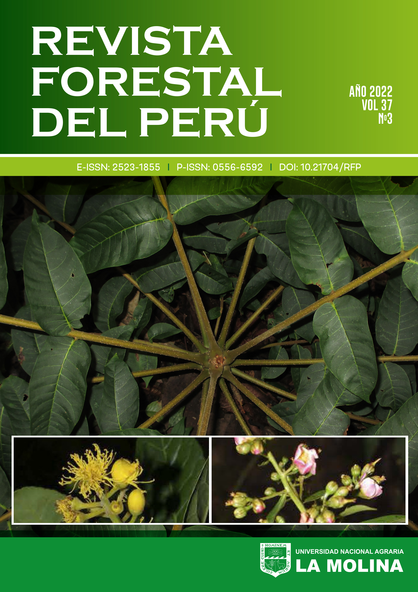

<!-- README.md is generated from README.Rmd. Please edit that file -->

# perutimber

## <a href='https://github.com/PaulESantos/perutimber'></a>

<!-- badges: start -->

[](https://lifecycle.r-lib.org/articles/stages.html)
[](https://CRAN.R-project.org/package=perutimber)
[](https://github.com/PaulESantos/perutimber/actions/workflows/R-CMD-check.yaml)
[](https://www.repostatus.org/#active)
<!-- badges: end -->

The R package, `perutimber`, provides easy access to taxonomic
information for over 1,300 vascular plant species found in the
**“Catalogue of the timber forest species of the Amazon and the Peruvian
Yunga”**. This package is based on the authoritative publication by
[Vásquez Martínez and Rojas Gonzáles (2022) titled “Catálogo de las
especies forestales maderables de la Amazonía y la Yunga Peruana” in
Revista Forestal del Perú 37(3, Número Especial):
5-138](https://revistas.lamolina.edu.pe/index.php/rfp/article/view/1956).
With `perutimber`, researchers and enthusiasts alike can efficiently
explore and analyze the timber plant species.

## Installation

You can install the development version of `perutimber` like so:

``` r
pak::pak("PaulESantos/perutimber")
```

## Basic usage

- Check if species name it listed in the data base:

``` r
library(perutimber)
sps_list <- c("Pentaplaris davidsmithii", 
              "Quararibea wittiia",
              "Sterculia tessmanni", 
              "Sterculia tessmannia", 
              "Brosimum alicastrum subsp. bolivarense",
              "Brosimum alicastrum sub bolivarense",
              "Poa annua")
```

- `perutimber::search_perutimber` function can be used over a vector of
  species names. You can pass a character vector containing multiple
  species names as an argument to the function, and it will check
  whether each of those species names is listed in the data. The
  function will return a character vector indicating whether each
  species name is present or not. Here’s an example:

``` r
perutimber::search_perutimber(splist = sps_list)
#> [1] "Present"        "P_updated_name" "P_updated_name" "P_updated_name"
#> [5] "Present"        "P_updated_name" ""
```

- `perutimber::search_perutimber` can be used with a data.frame or
  tibble. Here’s an example of how to use it:

``` r
 # base R
sps_df <- data.frame(sps_list)
sps_df
#>                                 sps_list
#> 1               Pentaplaris davidsmithii
#> 2                     Quararibea wittiia
#> 3                    Sterculia tessmanni
#> 4                   Sterculia tessmannia
#> 5 Brosimum alicastrum subsp. bolivarense
#> 6    Brosimum alicastrum sub bolivarense
#> 7                              Poa annua
sps_df$review <- perutimber::search_perutimber(splist = sps_list)
sps_df
#>                                 sps_list         review
#> 1               Pentaplaris davidsmithii        Present
#> 2                     Quararibea wittiia P_updated_name
#> 3                    Sterculia tessmanni P_updated_name
#> 4                   Sterculia tessmannia P_updated_name
#> 5 Brosimum alicastrum subsp. bolivarense        Present
#> 6    Brosimum alicastrum sub bolivarense P_updated_name
#> 7                              Poa annua
 # tidyverse - tibble
sps_tbl <- tibble::tibble(sps_list)
sps_tbl |> 
  dplyr::mutate(review = perutimber::search_perutimber(splist = sps_list))
#> # A tibble: 7 × 2
#>   sps_list                               review          
#>   <chr>                                  <chr>           
#> 1 Pentaplaris davidsmithii               "Present"       
#> 2 Quararibea wittiia                     "P_updated_name"
#> 3 Sterculia tessmanni                    "P_updated_name"
#> 4 Sterculia tessmannia                   "P_updated_name"
#> 5 Brosimum alicastrum subsp. bolivarense "Present"       
#> 6 Brosimum alicastrum sub bolivarense    "P_updated_name"
#> 7 Poa annua                              ""
```

- `perutimber::get_perutimber_data()` allows access to information
  provided in the “Catalogue of the timber forest species of the Amazon
  and the Peruvian Yunga”, to obtain information for a specific species,
  a species name vector must be provided as input. The function returns
  a data frame containing basic information for each species, such as
  its common and scientific names.

``` r
perutimber::get_perutimber_data(sps_list)
#>                          names_submitted                          accepted_name
#> 1               Pentaplaris davidsmithii               Pentaplaris davidsmithii
#> 2                     Quararibea wittiia                      Quararibea wittii
#> 3                    Sterculia tessmanni                   Sterculia tessmannii
#> 4                   Sterculia tessmannia                   Sterculia tessmannii
#> 5 Brosimum alicastrum subsp. bolivarense Brosimum alicastrum subsp. bolivarense
#> 6    Brosimum alicastrum sub bolivarense Brosimum alicastrum subsp. bolivarense
#>   accepted_name_author accepted_family
#> 1      Dorr & C. Bayer       Malvaceae
#> 2    K. Schum. & Ulbr.       Malvaceae
#> 3              Mildbr.       Malvaceae
#> 4              Mildbr.       Malvaceae
#> 5  (Pittier) C.C. Berg        Moraceae
#> 6  (Pittier) C.C. Berg        Moraceae
#>                                          common_name accepted_name_rank habit
#> 1                                       Ojoso blanco            species Árbol
#> 2                        Huayhuash sapote, Sapotillo            species Árbol
#> 3                                   Sapote del monte            species Árbol
#> 4                                   Sapote del monte            species Árbol
#> 5 Congona, Machinga, Palo leche, Rama pama, Tamamuri         subspecies Árbol
#> 6 Congona, Machinga, Palo leche, Rama pama, Tamamuri         subspecies Árbol
#>   plant_height_m             regions    elevation_m                        uses
#> 1  25-35(-40) m.                 JU.       100-1000       con aptitud maderable
#> 2       10-25 m.     LO, MD, SM, UC.        100-500       con aptitud maderable
#> 3       15-25 m. AM, LO, MD, PA, UC.        100-500             madera aserrada
#> 4       15-25 m. AM, LO, MD, PA, UC.        100-500             madera aserrada
#> 5  20-30(-35) m.         AM, LO, MD. 100-500(-1500) maderable - madera aserrada
#> 6  20-30(-35) m.         AM, LO, MD. 100-500(-1500) maderable - madera aserrada
```
